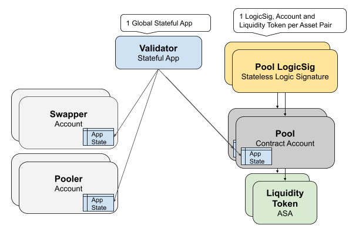
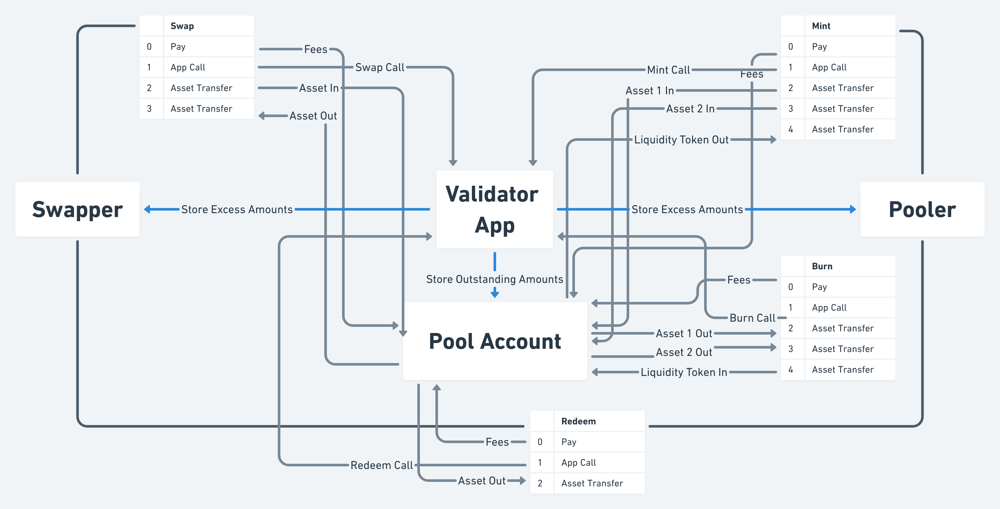

# Design Doc

This document outlines the design for a permissionless distributed exchange on Algorand conducted by an automated market maker (AMM). This exchange is modeled after [Uniswap](https://uniswap.org/docs/v2/protocol-overview/how-uniswap-works) on Ethereum. The AMM will be implemented on-chain as Algorand TEAL smart contracts.&#x20;

### Terminology 

* Pools - liquidity pools holding 2 assets
* Poolers - users who provide assets to the Pools
* Swappers - users who trade/swap assets through Pools
* Assets - Algorand Standard Assets (ASAs) and Algo
* Liquidity Token - An ASA that represents a share of the value of a Pool

### Assumptions 

* The exchange will be permissionless, meaning that anyone can use it.
* The exchange is fully decentralized and immutable - nobody can update/delete/freeze the Pools or assets.
* The exchange is non-custodial. Only the Poolers have access to their shares of the Pools.
* The AMM will be a [constant product market maker](https://github.com/runtimeverification/verified-smart-contracts/blob/uniswap/uniswap/x-y-k.pdf), like Uniswap.
* The Pools hold assets in a 50/50 ratio.
* The AMM will allow exchange between pairs of Algorand Standard Assets (ASAs) or ASA and Algo.
* The ASAs should have high liquidity - a large total supply (not NFTs or collectables).
* The minimum swap/mint/burn size is expected to be 1000 microunits.
* A percentage based fee is charged on every trade, called the swap fee. This fee increases a Pool’s liquidity and benefits liquidity providers (Poolers).

### Users 

This exchange is designed to be used by two parties: Swappers and Poolers (liquidity providers).

* Swappers - use the exchange to swap one asset for another.
* Poolers - contribute assets to a Pool in the exchange, and in return, they are given liquidity tokens.
  * Liquidity tokens can be returned at any time to the Pool for a proportion of the Pool’s assets equal to the proportion of liquidity tokens being returned.

### Architecture 

Liquidity Pools are implemented as contract accounts controlled by LogicSignatures. A stateful smart contract, the Validator app, implements the validation and state changing logic for all Pools.

The Validator app is deployed to the network by the Tinyman team. The Pool contract accounts are created from the Pool LogicSig template by the first Pooler who wishes to provide liquidity.

#### Validator App 

* Stateful smart contract
* Created by Tinyman core team
* Fully immutable
  * No updates allowed
  * No deletion allowed
* No global state
* Local state in Pool, Pooler, Swapper accounts (16 ints, 0 bytes)
* Contains validation and state manipulation logic for all operations

#### Pool Logic Signature Template

* A stateless smart contract template
* Template variables for asset 1 and asset 2 ids
* Pool contract account address retrieved by hashing the completed template
* Contains logic to ensure only transactions part of expected transaction groups are signed
* Delegates most logic responsibility to the Validator app by ensuring the transaction group contains a call to the Validator App with appropriate arguments

#### Pool Contract Account

* One Pool account per asset pair
* Exclusively controlled by the Pool Logic Signature (No associated private key)
* Creates/owns the Liquidity Token asset for the Pool

#### Liquidity Token Asset

* An Algorand Standard Asset (ASA)
* One liquidity token asset per Pool
* Created by the Pool
* Fully permissionless
  * No freeze permission
  * No clawback permission
  * No management permission

## Operations 

This section describes how Pools are found, created, and used.

### Lookup

In order to use a Pool, users must know the address of the LogicSig account.

To get the address of the Pool LogicSig account, we make its TEAL contract template publicly available. Users can then fill out the template with the two assets IDs that they want to exchange and then hash it to get its address. This provides a deterministic way to find the address of a Pool and ensures that only one Pool exists for an asset pair.

Once the user knows the Pool LogicSig account address, they can query the account state to find the only asset created by the Pool, the Liquidity Token.

The current balances (and thus exchange rate) of the Pool are found by querying the Pool account state to find the asset balances and the Validator app local state. This information can be combined to retrieve the current balances and exchange rate.

### Creation

In case an address for a Pool with certain assets represents an account that has not yet been created, any user can create that Pool by funding that address and executing some bootstrap transactions. The address needs funding because of the minimum balance associated with opting into the Validator App, opting into the assets, creating its own liquidity token asset, and paying for transaction fees. If there is sufficient interest in a Pool, some user should be willing to donate these funds. The account that bootstraps the Pool does not need to be the account that mints the first liquidity. These are separate operations. The bootstrapper does not have any form of ownership or privilege over the Pool.

#### Bootstrap Process

The goal of the bootstrap process is to allow any user to create a new Pool without the possibility that the Pool could get stuck in an invalid state.

The bootstrap operation consists of a single atomic group of 5 transactions:

1. Pay Algo to cover fees and minimum balance&#x20;
2. Opt-In to Validator app, with args \['bootstrap', asset1ID, asset2ID]&#x20;
3. AssetConfig - create asset for liquidity token
4. Asset OptIn - Pool opt in to Asset 1
5. (Optional) Asset OptIn - Pool opt in to Asset 2

Transaction 0 must cover the minimum balance + the fees for the subsequent 3 (or 4) transactions (3 (or 4) \* 1000 microAlgo).&#x20;

The calculation for the minimum balance is as follows:

`minBalance = 100000 // min account balance`\
&#x20;          `+ 100000 // min balance to create asset`\
&#x20;          `+ 100000 // fee + min balance to opt into asset 1`\
&#x20;          `+ (asset2Optin ? 100000 : 0) // min balance to opt into asset 2`\
&#x20;          `+ 100000 + (25000+3500)*numLocalInts`\
&#x20;          `+ (25000+25000)*numLocalByteSlices; // min balance to opt into validator app`

The Validator App has numLocalInts=16 and numLocalByteSlices=0 so the minBalance is 956000 for a ASA-ASA pool and 856000 for a ASA-Algo pool.

Transactions 1-4 must be signed by the Pool LogicSig which will verify that the provided values are correct. The Validator app will store the asset IDs in its local state in the Pool account, so that they can be referenced later.

Because this is an atomic group, if any of these transactions do not meet the criteria defined in the Validator contract or the Pool LogicSig contract, all transactions will fail.

Once the Pool account is created and bootstrapped, the Pool is ready to mint liquidity tokens.

### Mint Liquidity

A user (Pooler) can mint liquidity by contributing equivalent values of each asset in a pair to that pair’s Pool account. In return, the Pool rewards the user with liquidity tokens in proportion to the amount of assets they contributed.&#x20;

The initial liquidity token amount is calculated as the geometric mean of the two asset amounts provided: `initial liquidity token amount = sqrt(asset1 * asset2)`

The first 1000 units of the liquidity token are ‘locked’ to prevent rounding errors in the calculation so the first minter receives `sqrt(asset1 * asset2) - 1000` liquidity tokens.

Subsequent minting should maintain the current ratio of the two assets.

Liquidity tokens are minted according to the following formula:

`liquidity_token_out = Min(`\
&#x20;   `(asset1_amount / asset1_supply) * issued_liquidity_tokens,`\
&#x20;   `(asset2_amount / asset2_supply) * issued_liquidity_tokens`\
`)`

Note: A Pooler may provide assets in another ratio but they will only be minted liquidity tokens for the smaller amount so they would effectively be providing a donation to the Pool.&#x20;

Aside from Algorand transaction fees, there are no fees charged to Poolers for minting.

### Burn Liquidity

Any user in possession of liquidity tokens can ‘burn’ them (some or all) at any time by exchanging them with the Pool for the corresponding proportion of the Pool’s assets.

For example, if a Pool has a balance of 10 asset A, 100 asset B and has issued 10 outstanding liquidity tokens, 1 liquidity token can be burnt for 1 asset A and 10 asset B. The Pool would then have a balance of 9 asset A, 90 asset B and have issued 9 outstanding liquidity tokens.

If a user wants to mint/burn liquidity and only wants to send/receive one asset from a pair, a convenience method can be implemented that swaps half the amount of the asset for them before a mint or after a burn. This method will only be practical for insignificant amounts of liquidity, since larger additions/subtractions would skew the exchange rate unfavorably.

Aside from Algorand transaction fees, there are no fees charged to Poolers for burning.

The asset out amounts are calculated as follows:

`asset1_out = asset1_supply * (burn_amount / issued_liquidity_tokens)`\
`asset2_out = asset2_supply * (burn_amount / issued_liquidity_tokens)`

### Swap 

Given a Pool account for assets A and B that has non-zero liquidity, a user can use this Pool to swap some amount of asset A for asset B, or some amount of asset B for asset A. The exact exchange rate is determined by the ratio of assets A and B that the Pool account holds and the amount of assets the user wants to swap, in addition to the exchange fee. Since a swap changes the ratio of assets that the Pool account holds, every swap has an effect on the exchange rate. Small swaps on Pools with lots of liquidity have the least effect.

#### Slippage Tolerance

The exchange rate between a pair of assets changes constantly due to transactions in the Pool. Between the time the Swapper prepares their swap transaction and the time the swap is executed, the exchange rate may have changed, or ‘slipped’. The concept of ‘slippage tolerance’ defines how much of a slippage the Swapper is willing to tolerate. The tolerance is defined as a percentage. 0% means the Swapper does not tolerate any slippage and wants the exact quoted amounts or the transaction should fail. A slippage of 100% would allow the received amounts to drop to 0. Usually this value is somewhere around 1%.

#### Swap Types

There are two types of swaps that the Swapper can choose from when submitting a swap transaction group. These two types determine which side of the swap the slippage is applied to:

* Fixed input swaps: this swap involves a fixed amount of the input asset and requests a variable amount of the output asset. For example, a user might want to exchange exactly 10 USDC for any amount of Planet Tokens at the current market rate.
* Fixed output swaps: this swap involves a variable amount of the input asset and requests a fixed amount of the output asset. For example, a user might want to exchange any amount of USDC for exactly 50 Planet Tokens at the current market rate.

#### Fixed input calculation 

amount\_out = (asset\_in\_amount \* 997 \* output\_supply) / ((input\_supply \* 1000) + (asset\_in\_amount \* 997))

#### Fixed output calculation

amount\_in = ((asset\_out\_amount \* input\_supply \* 1000) / ((output\_supply - asset\_out\_amount) \* 997)) + 1\

#### Swap Fees 

Aside from Algorand transaction fees, Swappers must pay a swap fee of 0.3% to the Pool. This fee is deducted from the input or output amount depending on the swap type. The fee is calculated into the swap quote returned by the Web UI or SDK.

Note: The fees paid in Algo in the first transaction of a Swap transaction group cover the transaction fees of the subsequent transactions, NOT the swap fee.

The swap fees increase the assets of the Pool and thus increase the value of the Pool shares owned by the Poolers. Swap fees cannot be redeemed by Poolers separately from their Pool shares.&#x20;

**Protocol Fees**

A portion of the swap fees (1/6th) are granted to the system and are known as Protocol Fees. Liquidity tokens proportionate to 1/6th of the fee amount are minted and set aside. These are redeemable only by a specific account (the creator of the Validator App) and are intended to fund a treasury.

**Protocol fee calculation for fixed input swap:**

`protocol_fee_portion = asset_out_amount * 0.05%`\
`protocol_fee_portion = (asset_out_amount * 5) / 10000`

The protocol is granted a share of the pool for half of this amount because it's a 50/50 pool:

`protocol_fee_asset_out_amount = (asset_out_amount * 5) / 20000`\
`protocol_fee_liquidity_tokens = issued_liquidity_tokens * (protocol_fee_asset_out_amount / output_supply)`

## Implementation 

Algorand smart contracts have some limitations that the AMM implementation must work around. The primary one is that smart contracts cannot directly send assets to users; they can only approve or deny transactions sent by users. However, stateful smart contracts can manipulate local account state.&#x20;

The user interacts with a Pool by preparing a set (atomic group) of transactions specific to the operation they wish to perform. If the structure and values of all parameters of all transactions in the group match the expectations of the contracts, the operation is executed. The expected values of the parameters depend on hard coded values in the contracts and also local app state stored in the Pool account. The user must lookup the current balances and app state values to determine the correct inputs for each operation.  (This is handled for the actual end user by the Web App of course.)

It is expected that there will be highly concurrent use of the Pools so the Pool balances and state values will constantly be in flux. This presents a (frustrating) challenge for a user that needs to submit transactions with exactly correct values. It is highly probable that the expected values will have changed by the time the transactions are executed, even if only a couple of seconds pass.

To handle this issue the Pool supports a form of slippage tolerance in Mint, Burn and Swap operations. The user specifies the minimum amount they expect to receive in the asset out transfer. The contract allows the transaction group to succeed if this can be satisfied but it also calculates and records any excess asset that is owed to the user in a fair trading scenario. This excess is stored and can be redeemed with a subsequent Redeem operation.

#### Excess and Outstanding Amounts

The excess amounts for all pools are stored in the local state of the Validator app. The state keys for each asset are prefixed by the Pool address to allow for excess amounts of the same asset from multiple pools.

The user must Opt-In to the Validator app so that it may store excess amounts in the local state. There is a limit of 16 state variables available. These are shared by all Pools. It is possible that a User will interact with many Pools and exhaust the available state slots available. In this case the user will be prompted to Redeem (and thus clear) excess amounts before continuing.

The Pool also needs to track the total outstanding amounts of each asset that are owed to users and subtract these from the asset balances to determine the actual asset supply when calculating swap/mint/burn amounts. These outstanding amounts for each asset are held in local state variables of the Pool (one for each of asset 1, asset 2 and the liquidity token). The outstanding amounts are reduced when a user redeems assets.

#### Fixed Input Swaps 

Instead of asking the Pool account to send the exact amount of an asset the Swapper wants from the swap, this transaction would specify the minimum amount of the asset the Swapper wants. If the swap executes, the Swapper is guaranteed to get this minimum amount by the nature of atomic transaction groups. However, in most cases when a swap executes, the amount of the asset the Swapper is due to receive would exceed the minimum amount they asked for. This excess amount would be recorded in their local state by the Validator App contract. In a subsequent transaction group, the Swapper can claim this amount from the Pool account.

For example, consider a Swapper who submits a swap exchanging exactly 1 of asset A for at least 2 of asset B. When their swap transaction executes, the exchange rate is such that 1 of asset A is equivalent to 3 of asset B, so their transaction is approved and 1 unit of asset B is recorded as an excess balance in their local state. The Swapper can then submit a transaction immediately after they see the result of their swap to claim the additional 1 unit of asset B.

#### Fixed Output Swaps

Instead of the asset in transaction declaring the exact amount of the input asset they wish to swap, that transaction would specify the maximum amount of the asset they want to swap. The amount specified by the asset out transaction from the Pool account still represents the exact amount of the asset the Swapper wants to receive. If the desired amount of the output asset can be exchanged using less than the maximum input asset amount, this difference would be recorded in the Swapper’s local state by the Validator App contract, similar to the excess amount in a fixed input swap. This reduced amount of input assets can be claimed by the Swapper in a subsequent transaction group.

For example, consider a Swapper who submits a swap exchanging at most 2 of asset A for exactly 1 of asset B. When their swap transaction executes, the exchange rate is such that 1.5 of asset A is equivalent to 1 of asset B, so their transaction is approved and 0.5 units of asset A is recorded as an excess balance in their local state. The Swapper can then submit a transaction immediately after they see the result of their swap to claim the 0.5 units of asset A that were not needed in the swap.

This mechanism allows for the output assets to be sent to a different account if the sender wishes to do so and the recipient is able to receive the asset. This enables use cases like the following: I have a balance of 500 asset A and I need to pay my friend exactly 10 asset B. I can submit a fixed output swap for exactly 10 asset B in exchange for at most 500 asset A and change the recipient of the asset out transaction to my friend’s address. When the operation succeeds, my friend will receive exactly 10 asset B and I will have paid an equivalent amount of asset A.

#### Liquidity

A similar procedure also applies to minting and burning liquidity tokens, since frequent small fluctuations in liquidity necessitate the need to have a slippage tolerance in these situations too.

#### Redeeming

To redeem excess amounts from a Pool the user must submit a transaction group for the Redeem operation. This consists of a transaction to pay translation fees, a call to the Validator app and a transaction to transfer assets from the Pool to the user. The transactions will only be successful if the requested amount in the transfer is less than or equal to the current excess assets of the Pool. The redeemed amount is deducted from both the excess asset amount in the user’s local state and the outstanding asset amount in the Pool’s local state.

If the excess amount for an asset is reduced to 0 by a redeem operation, the corresponding slot of local state is cleared rather than set to 0. This prevents issues with exhausting the available slots when interacting with multiple pools.

The redeem operation is used by both Swappers and Poolers to claim excess amounts of Asset 1, Asset 2 and the Liquidity Token for Poolers.

Aside from Algorand transaction fees, there are no fees charged to Users for redeeming. A redemption requires 3 transactions with a total fee of 3000 microAlgos (currently), so it may not always be cost effective to redeem excess amounts immediately.

#### Protocol Fees

The protocol Treasury account accumulates liquidity tokens proportional to 1/6th of the swap fee ( 5/10000ths of the swap value). These liquidity token assets cannot be transferred inline to the treasury account, so they are stored in a local state variable in the Pool account and added to the outstanding liquidity token amount state variable. The creator of the validator app can redeem these amounts as liquidity tokens using a ‘fees’ operation. This account is the only account that can retrieve these assets.

#### Transaction Group Structure

All interactions with the Pool involve the use of atomic transaction groups. These have a common basic structure to make validation easier in the contract code.&#x20;

* The first transaction (gtxn 0) is always a Pay transaction from the User to the Pool to pay fees for the subsequent transactions that the Pool will make.&#x20;
* The second transaction (gtxn 1) is always an Application Call to the validator app with at least one argument. The first argument determines the type of the operation; bootstrap, mint, burn, swap, redeem. This transaction is always signed by the Pool LogicSig. This ensures both the Validator App and the LogicSig participate in validation of the transaction group.

#### Handling of Algo

Algo is the native currency of Algorand and is not represented as an Algorand Standard Asset. This has some implications for the handling of Algo as one of the assets of a pair in a Pool. The general formulae remain the same for Pools with Algo, but the implementation has to explicitly handle the case. The Algo has a special asset id of 0 and this is checked in various places in the code.

Transfers of Assets are made using an AssetTransfer transaction while an Algo transfer is made using a Pay transaction. This requires the code to check the fields of either AssetTransfer or Pay transactions. Similarly, the Algo balance is accessed differently from ASA balances. The Pool’s Algo asset reserves must be separated from it’s actual balance by subtracting Algo amounts that are held for other reasons. The Pool must hold a minimum balance of Algo to Opt-In to assets and the Validator app. This minimum balance is not considered part of the reserves of the Pool. Similarly, the transaction fees are transferred to the Pool in the first transaction of each group. These temporarily inflate the balance of the Pool and need to be subtracted to determine the actual reserve amount.&#x20;

## User Flows

### Swapper

1. Opt-In to Validator App (once)
   1. Prepare, sign, submit, wait for completion
2. Opt-In to Asset Out if necessary
   1. Prepare, sign, submit, wait for completion
3. Lookup Pool info for asset pair
4. Do Swap
   1. Prepare, sign, submit, wait for completion
5. Do Redeem (for excess amounts)
   1. Prepare, sign, submit, wait for completion

### Pooler

1. Opt-In to Validator App (once)
   1. Prepare, sign, submit, wait for completion
2. Lookup Pool info for asset pair
3. Create Pool if it doesn’t exist
   1. Prepare, sign, submit, wait for completion
4. Opt-In to Pool Liquidity Token Asset
   1. Prepare, sign, submit, wait for completion
5. Do Mint
   1. Prepare, sign, submit, wait for completion
6. Do Redeem (for excess liquidity Token)
   1. Prepare, sign, submit, wait for completion

### &#x20;
