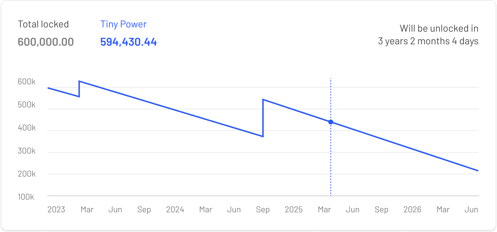

# Overview

<figure><figcaption>
Tinyman Governance Workflow
</figcaption></figure>

## Governance Forum:&#x20;

The Tinyman Governance Forum is where our community shapes the future of [Tinyman](https://tinyman.org/), embracing decentralization and effective governance. Here, every community member can propose, discuss, and evolve ideas in a structured, transparent environment.

The forum is designed as the starting point for all governance activities. You’ll begin by discussing and refining proposals with community feedback, then move these proposals through a structured process of validation and execution, which includes both forum-based discussions & voting and on-chain voting. Here’s how you can participate:

## Governance Forum Process:

The forum is your first step in the governance process, where you can engage with the community to refine ideas, gather initial feedback, and join voting.

* **Proposal Discussion**: Start by posting your idea in the Governance Forum to solicit community feedback and further develop your proposal based on the discussions.
* **Proposal Submission**: After refining your proposal with community input, you can move it one step forward. This includes a more detailed version of your proposal following a specific template that outlines the goal, detailed actions, and expected outcomes.
* **Community Polling**: Proposals that achieve sufficient support in the forum through off-chain community polling (requiring at least 50 votes and over 50% approval) can move forward. For the next 3-6 months, forum polling is required before moving to the on-chain part to prevent abuse. This ensures that proposals have community backing before progressing.

## On-Chain Voting Process:

* **On-Chain Submission**: Successful proposals are submitted for on-chain voting on [https://tinyman.org/#/governance/proposals](https://tinyman.org/#/governance/proposals), where they undergo a structured process that includes a waiting period and a voting period. To initiate a proposal, the proposer must hold 450K $TINY Power. Proposals that do not meet the forum approval criteria will be removed from the Tinyman interface.
* **​​Waiting Period**: Once on-chain, proposals enter a waiting period (approximately 2 days) to ensure all community members are informed.
* **Voting Period**: The proposal is open for voting for 7 days, enabling all governors to participate. This on-chain process requires governors to connect their wallets to verify their positions in the governance vault. They must sign a transaction, which will be recorded on the blockchain. The influence of governors on the voting outcome is proportional to their voting power. The proposal requires at least 2.25 million "YES" votes in Tiny Power to pass.
* **Execution**: If approved, proposals are automatically executed after a 2-day timelock, integrating the changes into the Tinyman ecosystem.

This structured approach ensures thorough community involvement and the integrity of the governance process, facilitating the automation and implementation of community-driven upgrades.

\
\

\
\
